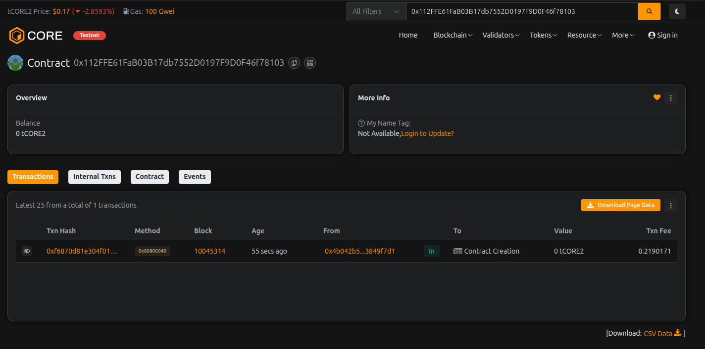

# CrossLend DAO

## Project Description

CrossLend DAO is a decentralized autonomous organization (DAO) built on the Ethereum blockchain that facilitates cross-chain lending governance. The platform enables community members to participate in decentralized decision-making processes while managing lending pools across multiple blockchain networks. Members can join the DAO, create and vote on proposals, add liquidity to lending pools, and collectively govern the lending protocol's parameters and operations.

The smart contract implements a robust governance system with voting mechanisms, liquidity management features, and member management capabilities. It provides a transparent and democratic way to operate a decentralized lending platform where all stakeholders have a voice proportional to their voting power.

## Project Vision

Our vision is to create a fully decentralized, community-governed lending ecosystem that operates seamlessly across multiple blockchain networks. CrossLend DAO aims to democratize access to financial services by removing intermediaries and putting control directly in the hands of the community. 

We envision a future where:
- Anyone can participate in governance decisions affecting the lending protocol
- Liquidity providers are rewarded fairly and transparently
- Cross-chain lending becomes as simple and accessible as traditional lending
- The community collectively determines interest rates, risk parameters, and protocol upgrades
- Decentralized finance becomes more inclusive, transparent, and efficient

## Key Features

1. **DAO Membership System**: Users can join the DAO with initial voting power, becoming active participants in governance decisions.

2. **Proposal Creation & Voting**: Members can create proposals for protocol changes and vote on them using their voting power. The voting period is set to 7 days for fair participation.

3. **Democratic Governance**: Proposals are decided based on the majority of voting power, with transparent for/against vote counting.

4. **Liquidity Pool Management**: Members can add and remove liquidity from lending pools, enabling decentralized lending operations.

5. **Dynamic Interest Rates**: Each lending pool can have configurable interest rates, managed through DAO governance.

6. **Voting Power Updates**: The contract owner can update member voting power, allowing for flexible governance structures.

7. **Comprehensive Data Access**: View functions provide complete transparency on proposals, members, and lending pools.

8. **Event Emission**: All critical actions emit events for easy tracking and integration with front-end applications.

9. **Security Features**: Includes modifiers for access control, preventing unauthorized actions and double voting.

10. **Scalable Architecture**: Designed to support multiple lending pools and an unlimited number of members and proposals.

## Future Scope

1. **Cross-Chain Integration**: Implement bridges to enable true cross-chain lending across Ethereum, Polygon, BSC, and other networks.

2. **Advanced Risk Management**: Integrate oracle services for real-time price feeds and implement automated liquidation mechanisms.

3. **Token Economics**: Create a native governance token (CLEND) with staking mechanisms and rewards for active participants.

4. **Delegation System**: Allow members to delegate their voting power to trusted representatives.

5. **Quadratic Voting**: Implement quadratic voting mechanisms to prevent whale dominance and promote fair governance.

6. **Flash Loans**: Add flash loan functionality to increase capital efficiency within the lending pools.

7. **Insurance Fund**: Establish a community-managed insurance fund to protect lenders against default risks.

8. **Multi-Signature Treasury**: Implement a multi-sig wallet for managing DAO treasury and executing high-value transactions.

9. **Reputation System**: Develop a reputation scoring system for borrowers to enable uncollateralized lending.

10. **Mobile & Web Interface**: Build user-friendly interfaces for seamless interaction with the DAO and lending pools.

11. **Automated Market Maker Integration**: Connect with DEXs to provide automated interest rate adjustments based on supply and demand.

12. **Governance Analytics Dashboard**: Create comprehensive analytics tools for tracking proposal success rates, member engagement, and pool performance.

## Contract Details:

Transaction id: 0x112FFE61FaB03B17db7552D0197F9D0F46f78103
